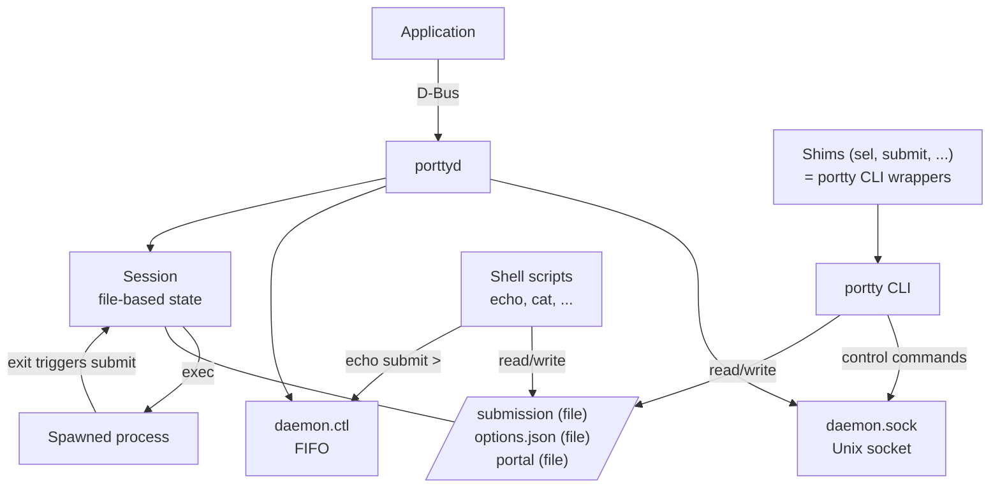

# Portty

Portty routes XDG Desktop Portal D-Bus requests into plain files and Unix sockets. Anything that can read and write files can respond to portal requests — a terminal, a shell script, a keybinding daemon, or `echo`.

## Implemented Portals

| Portal | Operations | Description |
|--------|-----------|-------------|
| FileChooser | `open-file`, `save-file`, `save-files` | File open/save dialogs |
| Screenshot | `screenshot`, `pick-color` | Screen capture and color picking |

## Architecture



### Workspace

| Crate | Binary | Description |
|-------|--------|-------------|
| `crates/lib` (libportty) | — | Shared library: protocol, codec, client, paths, files, portal validation |
| `crates/daemon` (porttyd) | `porttyd` | D-Bus service, session management, daemon socket + FIFO |
| `crates/cli` (portty) | `portty` | CLI for interacting with sessions and the daemon |

### Data Flow

1. An application requests a portal action via D-Bus (e.g. open file dialog)
2. The daemon checks for a queued submission — if one exists, it auto-applies and returns immediately
3. Otherwise, the daemon creates a session directory with file-based state (`options.json`, `submission`, `portal`)
4. The configured `exec` command is run (typically a terminal emulator, but can be any program — even `submit` for instant auto-confirm). If the process exits, the session submits automatically
5. The session's `submission` file can be edited by anything — the `portty` CLI, shell shims on `$PATH`, raw file I/O, or commands piped into the FIFO
6. On submit/cancel, the daemon reads the submission file, validates it against portal constraints, and returns results via D-Bus

### Session Directory

```
/tmp/portty/<uid>/
├── daemon.sock                # Unix socket (CLI <-> daemon, bidirectional)
├── daemon.ctl                 # FIFO (fire-and-forget commands)
├── pending/submission         # Entries queued before any session exists
├── submissions/<ts>-<portal>/ # Queued submissions (auto-applied on next dialog)
│   └── submission
└── <session-id>/
    ├── portal                 # "<portal>\n<operation>" (e.g. "file-chooser\nopen-file")
    ├── options.json           # Session options (from D-Bus request)
    ├── submission             # Current entries, one per line
    └── bin/                   # Shell shims prepended to $PATH
        ├── sel                # -> portty edit "$@"
        ├── desel              # -> portty edit --remove "$@"
        ├── reset              # -> portty edit --reset
        ├── submit             # -> portty submit
        ├── cancel             # -> portty cancel
        ├── info               # -> portty info
        └── <custom>           # From config [portal.bin] section
```

All data operations (editing submissions) are file-based. The daemon socket handles control commands only (submit, cancel, verify, reset, list).

## Interaction

There are multiple ways to interact with a session — they all do the same thing (edit files, send control commands):

### portty CLI / shims

The shims in `bin/` are one-line wrappers around `portty`. They're the same thing.

```bash
# These are equivalent:
sel file1.txt file2.txt        # shim
portty edit file1.txt file2.txt # CLI directly

# Edit submission
portty edit file1.txt file2.txt
portty edit --stdin              # read from stdin
portty edit --remove file1.txt   # remove entries
portty edit --clear              # clear all
portty edit --reset              # reset to initial state
portty edit                      # no args = print current entries

# Control
portty submit                    # confirm and complete the dialog
portty cancel                    # cancel the operation
portty verify                    # validate against portal constraints
portty info                      # show options.json + submission

# Management (context-independent)
portty list                      # list active sessions
portty queue                     # show pending + queued submissions

# Target a specific session
portty --session <id> submit
```

The CLI auto-detects context via `PORTTY_SESSION` env var — inside a session terminal it operates on the session directory, outside it operates on pending entries.

### Raw file I/O

Since state is just files, you can skip the CLI entirely:

```bash
# Read options
cat /tmp/portty/$(id -u)/<session-id>/options.json

# Write submission directly
echo "/path/to/file.txt" >> /tmp/portty/$(id -u)/<session-id>/submission

# Clear submission
> /tmp/portty/$(id -u)/<session-id>/submission
```

### FIFO

Fire-and-forget commands — useful for scripting and keybindings:

```bash
echo "submit" > /tmp/portty/$(id -u)/daemon.ctl
echo "cancel" > /tmp/portty/$(id -u)/daemon.ctl
echo "submit my-session-id" > /tmp/portty/$(id -u)/daemon.ctl
```

### Unix socket

For bidirectional communication (when you need the response):

```bash
echo "list" | socat - UNIX-CONNECT:/tmp/portty/$(id -u)/daemon.sock
```

### Submission Queue

Pre-queue entries before a dialog opens. When the next dialog arrives, the queued submission is auto-applied without running `exec`:

```bash
portty edit file1.txt file2.txt
portty submit
portty queue  # view the queue
```

## Daemon Control Protocol

Plain text, newline-terminated. Shared by the socket and FIFO.

### Request (single line)

```
submit [session_id]
cancel [session_id]
verify [session_id]
reset [session_id]
list
```

When `session_id` is omitted, the earliest active session is targeted.

### Response (socket only — FIFO discards responses)

```
ok
error: <message>
<id>\t<portal>\t<operation>\t<created>\t<dir>\t<title>\n
...
ok
```

Session listing emits one tab-separated line per session, terminated by `ok`.

## Configuration

`~/.config/portty/config.toml` — see [`misc/config.toml.example`](misc/config.toml.example) for a full annotated example.

Config resolution priority: **operation-specific > portal-specific > root default**.

```toml
exec = "foot"             # root default (auto-detected if not set)

[file-chooser]
exec = "foot"             # portal default

[file-chooser.save-file]
exec = "submit"           # operation override: auto-confirm saves

[file-chooser.bin]
pick = "fzf --multi | sel --stdin"  # custom shim on $PATH
```

Set `exec = ""` for headless mode (no process spawned, interact via CLI only).

### Session Environment

| Variable | Description |
|----------|-------------|
| `PORTTY_SESSION` | Session ID |
| `PORTTY_DIR` | Session directory path |
| `PORTTY_PORTAL` | Portal name (e.g. `file-chooser`) |
| `PORTTY_OPERATION` | Operation name (e.g. `open-file`) |

The session `bin/` directory is prepended to `$PATH`.

## Adding a New Portal

### 1. Define validation logic in libportty

Create `crates/lib/src/portal/<portal>.rs`:

```rust
use serde::{Deserialize, Serialize};

#[derive(Debug, Clone, Serialize, Deserialize)]
pub struct SessionOptions {
    // Fields from the D-Bus request that the session/CLI needs
}

/// Validate and transform submission entries.
/// Called at submit time — check constraints and produce final output.
pub fn validate(
    operation: &str,
    entries: &[String],
    options: &SessionOptions,
) -> Result<Vec<String>, String> {
    // Validate entries against options, return transformed entries
    Ok(entries.to_vec())
}

/// Smart add behavior (single-select replace vs multi-select append).
pub fn add_entries(
    sub_path: &std::path::Path,
    entries: &[String],
    options: &SessionOptions,
) -> std::io::Result<super::AddResult> {
    crate::files::append_lines(sub_path, entries)?;
    Ok(super::AddResult::Appended(entries.len()))
}
```

Register in `crates/lib/src/portal/mod.rs`:

```rust
#[cfg(feature = "portal-my-portal")]
pub mod my_portal;
```

Add the feature to `crates/lib/Cargo.toml`:

```toml
[features]
portal-my-portal = ["portal"]
```

Wire it into `SessionContext::add_entries()` and `validate()` in `crates/lib/src/portal/mod.rs`.

### 2. Define D-Bus types in porttyd

Create `crates/daemon/src/dbus/<portal>.rs` implementing the `org.freedesktop.impl.portal.*` interface using `zbus`. See `dbus/file_chooser.rs` or `dbus/screenshot.rs` as examples.

The key pattern: define a `Handler` trait that the portal implementation calls, and a D-Bus proxy struct that implements the zbus interface and delegates to the handler.

### 3. Implement the portal handler

Create `crates/daemon/src/portal/<portal>.rs`:

```rust
pub struct TtyMyPortal {
    config: Arc<Config>,
    state: Arc<RwLock<DaemonState>>,
}

impl MyPortalHandler for TtyMyPortal {
    async fn my_operation(&self, ...) -> Result<MyResult, MyError> {
        let session_options = SessionOptions { /* ... */ };
        let options_json = serde_json::to_value(&session_options)?;

        let entries = super::run_session(
            "my-portal",        // portal name
            "my-operation",     // operation name
            &options_json,
            &initial_entries,
            title.as_deref(),
            &self.config,
            &self.state,
        ).await?;

        // Transform entries into D-Bus result
        Ok(MyResult::new(entries))
    }
}
```

`run_session` handles the entire lifecycle: queued submission check -> session creation -> exec spawn -> wait -> unregister -> validate.

### 4. Register in the server

In `crates/daemon/src/server.rs`, add to `register_portals()`:

```rust
let my_portal = TtyMyPortal::new(Arc::clone(&self.config), Arc::clone(&self.state));
let builder = builder.serve_at(OBJECT_PATH, MyPortalProxy::from(my_portal))?;
```

### 5. Update the portal file

In `misc/tty.portal`, add the interface:

```ini
Interfaces=...;org.freedesktop.impl.portal.MyPortal
```

## Building

```bash
cargo build --release
```

Requires nightly Rust (uses `linux_pidfd` and `unix_mkfifo` features).

## Installation

```bash
# Install binaries
install -Dm755 target/release/porttyd /usr/lib/portty/porttyd
install -Dm755 target/release/portty /usr/bin/portty

# Install portal file
install -Dm644 misc/tty.portal /usr/share/xdg-desktop-portal/portals/tty.portal

# Install systemd service (optional)
install -Dm644 misc/portty.service /usr/lib/systemd/user/portty.service
```

## License

MIT
